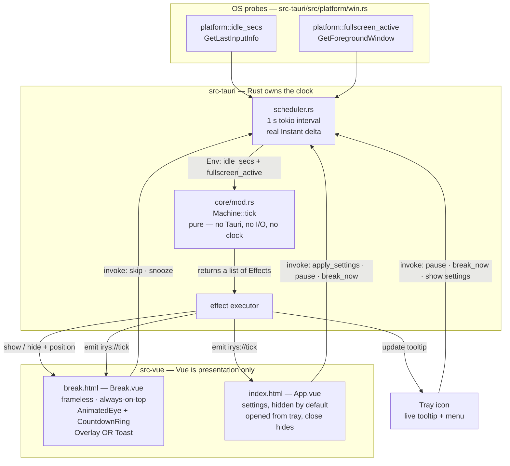

# Irys — Your companion for healthier eyes

## Context

Developers stare at screens all day, and sustained near-focus fatigues the eye's
focusing muscles (ciliary strain), which contributes to long-term visual decline.
The **30-30-30 rule** is the countermeasure: every **30 minutes**, look **30 feet
(~10 m)** away for **30 seconds**.

The problem with the rule is not knowing it — it's *remembering* it while in flow.
So Irys is a background desktop companion that owns the clock for you: it tracks
your work interval, interrupts at the right moment with an animated eye and a 30
second countdown, teaches the rule in the moment, and gets out of the way. It
stays quiet when you're already away from the keyboard or presenting.

**Target outcome:** an installable Windows desktop app (cross-platform-ready) that
runs from the tray, costs near-zero idle CPU/RAM, and makes the 30-30-30 habit
automatic.

**Stack:** Tauri 2 + Vue 3 + TypeScript + Vite. Rust owns all timing and state so
the schedule is compiler-checked and unit-testable; Vue owns only presentation.

**Current state of `c:\.repos\Personal\Irys`: empty apart from this plan.** This is
a greenfield build — no existing code to reuse, so every file below is new.

---

## Prerequisite: local toolchain is incomplete (blocker)

Probed this machine:

| Component | Status |
| --- | --- |
| Node 24.18.0 / npm 11.16.0 | ✅ present |
| git 2.55.0 | ✅ present |
| Edge WebView2 runtime 150.x | ✅ present (no bundling needed for dev) |
| **Rust / cargo / rustup** | ❌ **not installed** (no `~/.cargo`) |
| **MSVC C++ build tools + Windows SDK** | ❌ **not installed** (no `link.exe`, no VS install dir) |

Tauri cannot compile without both. Step 0 below installs them; it needs user
consent (a several-GB Visual Studio Build Tools download) and a shell restart.

---

## Architecture

**Why the timer lives in Rust, not JavaScript:** browser engines throttle
`setInterval` in hidden/minimized/background webviews. A JS timer would silently
drift — fatal for the one thing this app does. The Rust side ticks
independently of any window's visibility, and can run with zero windows shown.



### The pure core (the part that must be right)

`src-tauri/src/core/mod.rs` holds **no Tauri types, no I/O, and no clock**. It is
a total function over injected inputs, which makes the whole schedule testable
with `cargo test` and no window:

```rust
pub enum Phase {
    Work  { remaining: u32 },
    Break { remaining: u32 },
    Paused { resume_to: Box<Phase> },
}

pub enum BreakStyle { Overlay, Toast }

pub struct Settings {
    pub work_secs: u32,            // 1800  (the first 30)
    pub break_secs: u32,           // 30    (the third 30)
    pub snooze_secs: u32,          // 300
    pub style: BreakStyle,
    pub chime: bool,
    pub skip_when_idle: bool,
    pub idle_threshold_secs: u32,  // 60
    pub defer_on_fullscreen: bool,
    pub autostart: bool,
}

/// Everything the machine needs from the outside world, injected — never read.
pub struct Env { pub idle_secs: u32, pub fullscreen_active: bool }

pub enum Effect { ShowBreak(BreakStyle), HideBreak, Chime, Tray(String), Emit(Snapshot) }

impl Machine {
    pub fn tick(&mut self, env: Env, elapsed_secs: u32) -> Vec<Effect>;
    pub fn pause(&mut self)  -> Vec<Effect>;
    pub fn resume(&mut self) -> Vec<Effect>;
    pub fn break_now(&mut self) -> Vec<Effect>;
    pub fn skip(&mut self)   -> Vec<Effect>;  // end break early → restart work
    pub fn snooze(&mut self) -> Vec<Effect>;  // postpone by snooze_secs
    pub fn apply(&mut self, s: Settings) -> Vec<Effect>;
    pub fn snapshot(&self) -> Snapshot;       // serde → frontend
}
```

`tick` takes **`elapsed_secs`**, not an assumed 1, so the scheduler passes a real
`Instant` delta. A laptop resuming from sleep produces a huge delta; the machine
treats anything over a threshold as "you were away" and restarts the work
interval rather than firing a stale break instantly.

### Suppression rules (assumptions I'm making — flagging for review)

- **Idle** (`idle_secs >= idle_threshold_secs`) → **reset the work interval**, no
  break. Your eyes already rested; a reminder would be noise.
- **Fullscreen foreground app** (call, presentation, game) → **defer by
  `snooze_secs` and re-check**, don't skip. You still need the break; hijacking
  the screen mid-demo is unacceptable.
- Both are settings, both default **on**.

### Windows and their lifecycle

Two Vite entry points so the overlay never loads settings code:

| Window | Config | Behavior |
| --- | --- | --- |
| `settings` (`index.html`) | normal, decorated, `visible: false` | Created at startup hidden. Tray → show. `CloseRequested` → `api.prevent_close()` + `hide()` so the app keeps running. |
| `break` (`break.html`) | `decorations: false`, `always_on_top: true`, `skip_taskbar: true`, `transparent: true`, `shadow: false`, `visible: false` | Pre-created hidden at startup (avoids creation latency/white flash), then resized + positioned + shown per break. |

The **break window serves both styles** the user asked for, chosen at show time
from `settings.style`:

- **Overlay** — sized to the current monitor's full bounds, centered content,
  `set_focus()`. Escape and a visible **Skip** button always work.
- **Toast** — ~380×150, positioned in the bottom-right of the monitor **work
  area** (above the taskbar), not focus-stealing.

> Security note: a frameless, always-on-top, transparent fullscreen window is the
> same primitive UI-spoofing malware uses. Irys must therefore *always* be
> escapable — Escape closes it, Skip/Snooze are always visible, and it never
> captures raw input or blocks the OS. Never add a "cannot be dismissed" mode.

### Platform probes, isolated behind `cfg`

`src-tauri/src/platform/` exposes exactly two functions so the core stays pure
and non-Windows targets still compile:

```rust
pub fn idle_secs() -> u32;          // win: GetLastInputInfo + GetTickCount64
pub fn fullscreen_active() -> bool; // win: GetForegroundWindow rect == its monitor rect
```

`win.rs` uses the `windows` crate (already in Tauri's Windows dep tree) with
features `Win32_Foundation`, `Win32_UI_Input_KeyboardAndMouse`,
`Win32_UI_WindowsAndMessaging`, `Win32_Graphics_Gdi`. `stub.rs` returns
`(0, false)` for macOS/Linux. `unsafe` is confined to these two functions.

### Frontend

- **`AnimatedEye.vue`** — hand-written inline SVG (sclera, iris, pupil, eyelid)
  animated with CSS keyframes: a periodic blink, the iris drifting outward as if
  refocusing into the distance, the pupil dilating as it relaxes. **No external
  assets, no icon library, no font download** — keeps the CSP strict and the
  bundle tiny. Frozen under `prefers-reduced-motion: reduce`.
- **`CountdownRing.vue`** — SVG circle driven by `stroke-dashoffset` from a CSS
  custom property updated on each tick.
- **`RuleGuide.vue`** — the three steps rendered as the in-the-moment coaching
  text (*"Stop · Look ~10 m / 30 ft away · Hold 30 s"*), plus a one-line "why" in
  settings.
- **`composables/useTimer.ts`** — subscribes once to `irys://tick`, exposes
  reactive `phase` / `remaining`; never runs its own timer.
- **`lib/types.ts`** mirrors the Rust `serde` types; **`lib/ipc.ts`** wraps
  `invoke` in typed functions so no raw command strings appear in components.
- **Chime** synthesized with a short WebAudio sine envelope — no audio file, so
  nothing to load and nothing to allow in the CSP. Off by default.
- Light/dark via `prefers-color-scheme`.

### Persistence & capabilities

- `plugin-store` → single JSON in the app config dir; settings only, **no secrets**.
- `plugin-autostart` → HKCU `Run` entry, user-scoped, no elevation, toggleable.
- `plugin-notification` → optional soft "break in 30 s" pre-warning.
- **Least privilege:** two capability files. `capabilities/break.json` grants the
  break window only event listening + `core:window:allow-hide`. Settings gets
  store/autostart/notification. **No `shell`, `fs`, `http`, or `dialog` plugins
  are added at all.** CSP in `tauri.conf.json`:
  `default-src 'self'; img-src 'self' data:; style-src 'self' 'unsafe-inline'; script-src 'self'`.

---

## Files to create

```
Irys/
├─ package.json  vite.config.ts  tsconfig.json  .gitignore
├─ index.html                      # settings entry
├─ break.html                      # break entry
├─ src-vue/                        # Vue frontend
│  ├─ main.ts  break.ts
│  ├─ App.vue  Break.vue
│  ├─ components/AnimatedEye.vue  CountdownRing.vue  RuleGuide.vue  SettingRow.vue
│  ├─ composables/useTimer.ts  useSettings.ts
│  ├─ lib/ipc.ts  lib/types.ts
│  └─ styles/theme.css
└─ src-tauri/                      # Rust backend
   ├─ Cargo.toml  tauri.conf.json  build.rs
   ├─ capabilities/settings.json  capabilities/break.json
   ├─ icons/                       # template icons for dev
   └─ src/                         # stays `src` — name fixed by cargo
      ├─ main.rs  lib.rs
      ├─ core/mod.rs               # Machine · Phase · Settings · Effect (pure)
      ├─ core/tests.rs             # the real test surface
      ├─ scheduler.rs  effects.rs
      ├─ windows_mgr.rs  tray.rs  commands.rs  settings_store.rs
      └─ platform/mod.rs  platform/win.rs  platform/stub.rs
```

**On the `src-vue/` rename:** `create-tauri-app` scaffolds the frontend as `src/`,
so step 1 renames it and updates three places — `vite.config.ts`
(`build.rollupOptions.input` for both entries, plus the `@` alias), `tsconfig.json`
(`include`), and the `<script type="module" src="/src-vue/…">` tags in the two HTML
entries. The Rust crate's own `src-tauri/src/` keeps its name; cargo requires it.

Pinned versions (verified against the registry today):

| Package | Version | Note |
| --- | --- | --- |
| `@tauri-apps/cli` | `2.11.4` | |
| `@tauri-apps/api` | `2.11.1` | |
| `@tauri-apps/plugin-store` / `-autostart` / `-notification` | `2.4.4` / `2.5.1` / `2.3.3` | |
| `vue` | `3.5.40` | |
| `vite` / `@vitejs/plugin-vue` | `8.2.0` / `6.0.8` | plugin-vue 6 peer-accepts vite 8 |
| `vue-tsc` | `3.3.9` | |
| `typescript` | **`~5.9`, not latest** | latest is `7.0.2`, the native rewrite; `vue-tsc` 3.x is validated against the TS 5 compiler API. Pinning 5.x avoids a type-check toolchain gamble on day one. |

`Cargo.toml`: `tauri` 2, `tauri-plugin-*` matching the JS plugins, `serde`,
`serde_json`, `tokio` (time), `windows` (cfg-gated).

---

## Build order

**0. Prereqs (needs your OK — installs, and a shell restart).**
`rustup` via `winget install Rustlang.Rustup`, then
`winget install Microsoft.VisualStudio.2022.BuildTools` with the *Desktop
development with C++* workload. Verify: `rustc -V`, `cargo -V`, `link.exe` found.

**1. Scaffold + first light.** `git init`; scaffold Tauri 2 + Vue + TS; convert
Vite to two entry points via `build.rollupOptions.input`. Gate: `npm run tauri
dev` opens a window.

**2. Pure core + tests — before any UI.** Write `core/mod.rs` and `core/tests.rs`
together. Gate: `cargo test` green, covering: work→break transition at zero;
break→work; pause/resume round-trip preserves remaining; skip and snooze;
`apply()` mid-interval clamps remaining; idle above threshold resets instead of
breaking; fullscreen defers rather than skips; a huge `elapsed_secs` (sleep/wake)
restarts the interval instead of firing a stale break.

**3. Scheduler, tray, window manager.** 1 s driver, effect executor, tray with
live tooltip (`Next break in 12:34`) and menu: *Take a break now · Pause/Resume ·
Settings · Quit*. Tooltip updates every tick; the menu is **not** rebuilt per
tick (flicker + cost) — only the one dynamic label. Gate: with `work_secs` set to
60, a blank break window appears on schedule and disappears after 30 s.

**4. Break UI.** `Break.vue` + `AnimatedEye` + `CountdownRing` + `RuleGuide`,
Skip / Snooze / Escape, and both Overlay and Toast layouts from one component
tree. Gate: both styles look right and are dismissible.

**5. Settings window + persistence.** Interval, break length, snooze, style
(Overlay | Toast), chime, autostart, idle-skip, fullscreen-defer. Load on
startup, save on change, push into the machine via `apply()`. Gate: change a
setting, restart the app, setting persists and takes effect.

**6. Platform probes.** `win.rs` idle + fullscreen; wire into `Env`. Gate:
manual — see verification below.

**7. Polish + lockdown.** Reduced-motion, dark mode, chime, tighten the two
capability files to the minimum that still runs, CSP, real eye icon via
`npx tauri icon`, set a real bundle identifier (e.g. `app.irys.desktop` — **not**
the template's `com.tauri.dev`, which blocks release builds).

**8. Release build.** `npm run tauri build` → MSI + NSIS installer.

---

## Verification

**Automated**
- `cd src-tauri && cargo test` — the state machine, including every suppression
  and edge case in step 2. This is the real safety net; it needs no window.
- `cargo clippy -- -D warnings` and `cargo fmt --check`.
- `npx vue-tsc --noEmit` — frontend types match the Rust `serde` shapes.

**Manual, end-to-end (`npm run tauri dev`, `work_secs = 60` to iterate fast)**
1. **Fires on time** — app starts with no visible window, tray icon present,
   tooltip counts down; at zero the break appears in the configured style.
2. **Ends on time** — 30 s countdown completes, window hides, tooltip restarts.
3. **Always escapable** — Escape, Skip, and Snooze each work in Overlay mode.
   Snooze re-fires after `snooze_secs`. *(Non-negotiable — verify every time.)*
4. **Both styles** — switch Overlay ↔ Toast in settings, confirm the next break
   uses the new style and Toast leaves the screen usable.
5. **Background accuracy (the whole point)** — minimize every window, work in
   another app for a full interval, confirm the break still fires exactly on
   time. This is what a JS timer would fail.
6. **Idle skip** — enable it, don't touch input for longer than the threshold,
   confirm no break fires and the interval resets.
7. **Fullscreen defer** — put a browser video fullscreen (F11) across the break
   moment; confirm the overlay is postponed, then fires after you exit.
8. **Tray lifecycle** — close the settings window; app keeps running and breaks
   keep firing. Quit from the tray actually exits.
9. **Autostart** — toggle on, confirm the HKCU `Run` entry, reboot or re-login,
   confirm Irys is running; toggle off, confirm the entry is gone.
10. **Sleep/wake** — sleep the machine across a break boundary; on resume, no
    instant stale break — the interval restarts.
11. **Footprint** — idle, confirm near-0% CPU and low RAM in Task Manager.
12. **Installer** — `npm run tauri build`, install the MSI on a clean profile,
    confirm it launches to tray and fires a break.

---

## Open items I decided rather than blocked on

- **Multi-monitor overlay** (one overlay per display) is *not* in scope — you
  picked Overlay + Toast, not the all-monitors variant. `windows_mgr.rs` is built
  around show-on-a-monitor, so adding a `overlay_all_monitors` toggle later is
  a contained change (enumerate `available_monitors()`, one window each).
- **Defaults:** idle threshold 60 s; suppressed-by-idle resets, suppressed-by-
  fullscreen defers 5 min; chime off; autostart off until you toggle it.
- **Cross-platform:** Windows is the build target, but all OS access sits behind
  `platform/`, so macOS/Linux compile today and only need those two functions.
