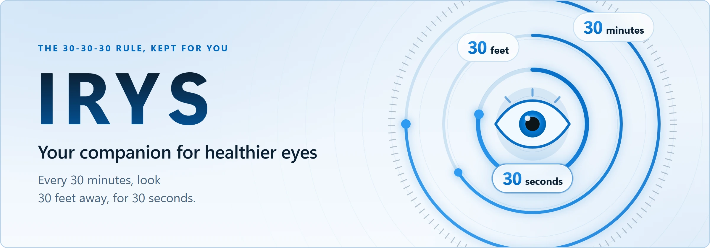
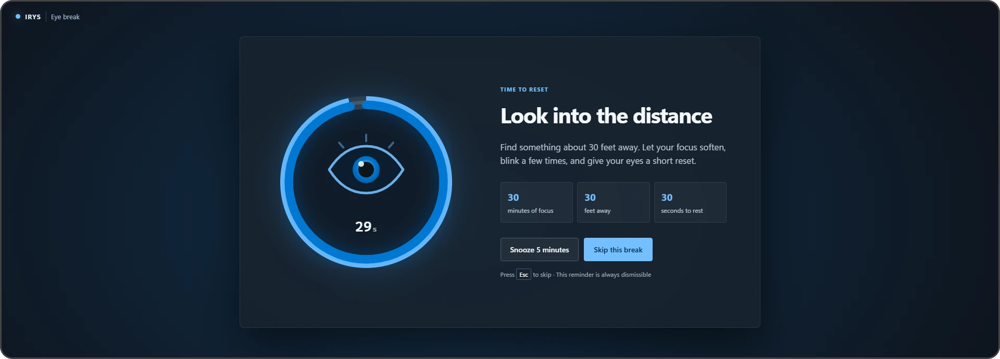
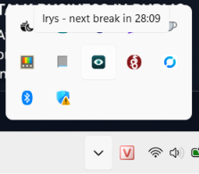
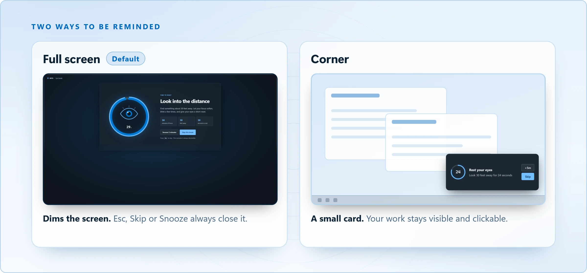
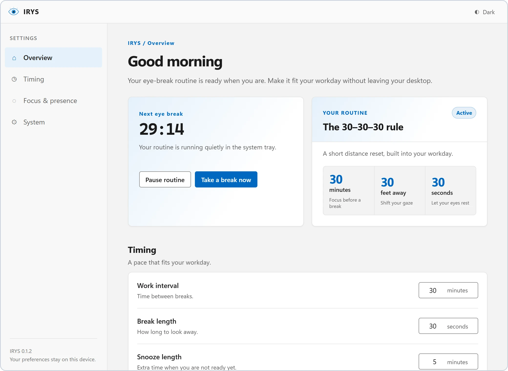
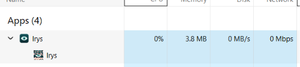

<h1 align="center"><picture><source media="(prefers-color-scheme: dark)" srcset="docs/readme/banner-dark.webp"></picture></h1>

<p align="center"><a href="https://github.com/the-khiem7/IRYS-desktop/releases/latest"><picture><source media="(prefers-color-scheme: dark)" srcset="docs/readme/nav-download-dark.webp"></picture></a> <a href="#how-it-works"><picture><source media="(prefers-color-scheme: dark)" srcset="docs/readme/nav-how-dark.webp"></picture></a> <a href="#what-you-get"><picture><source media="(prefers-color-scheme: dark)" srcset="docs/readme/nav-features-dark.webp"></picture></a> <a href="#install"><picture><source media="(prefers-color-scheme: dark)" srcset="docs/readme/nav-install-dark.webp"></picture></a> <a href="#privacy"><picture><source media="(prefers-color-scheme: dark)" srcset="docs/readme/nav-privacy-dark.webp"></picture></a> <a href="#for-developers"><picture><source media="(prefers-color-scheme: dark)" srcset="docs/readme/nav-dev-dark.webp"></picture></a></p>

<div align="center">

**Every 30 minutes, look 30 feet away, for 30 seconds.**

Irys keeps that habit for you, so you can forget about it and stay in flow.

[**Download for Windows or Linux**](https://github.com/the-khiem7/IRYS-desktop/releases/latest) · Free · No account



</div>

---

## The problem it solves

You already know staring at a screen all day is hard on your eyes. Holding focus at one close distance for hours tires the muscles that do the focusing, and that shows up as the tired, dry, slightly-blurry feeling at the end of a workday.

The 30-30-30 rule is the countermeasure eye-care guidance keeps coming back to, because it is simple enough to actually do:

| | |
|---|---|
| **30** minutes | Look up from the screen. |
| **30** feet (~10 m) | Find something far off. |
| **30** seconds | Hold your gaze there and let your eyes relax. |

The hard part was never knowing the rule. It is **remembering it while you are concentrating** - which is exactly when you are least likely to.

## How it works

Irys owns the clock for you. It sits in your tray, counts down quietly, and taps you on the shoulder at the right moment.

<picture><source media="(prefers-color-scheme: dark)" srcset="docs/readme/cycle-dark.webp"></picture>

## How it feels to use

### It waits in the tray and stays out of the way

Irys has no window open while you work. It lives as a small eye in your system tray, and its tooltip tells you exactly how long you have.



### When it is time, it asks for 30 seconds

Your screen dims, an eye blinks at you, and a ring counts down the thirty seconds. The rule is right there, so you never have to remember what to do - just look up and out.

**And you are always in control.** Not in the mood? **Snooze** pushes it back five minutes. **Skip** or the **Escape** key dismisses it immediately. Irys never locks your screen, never takes over your keyboard, and never shows you anything you cannot dismiss in one keystroke.

Prefer something gentler? Switch the reminder to **Corner** and it becomes a small card in the corner of your screen instead of taking over - your work stays visible and clickable the whole time.

<picture><source media="(prefers-color-scheme: dark)" srcset="docs/readme/styles-dark.webp"></picture>

### Everything is yours to tune

The 30-30-30 rule is the default, not a rule Irys enforces on you. Every number and behaviour is adjustable, and it takes effect immediately.

<picture><source media="(prefers-color-scheme: dark)" srcset="docs/readme/settings-dark.webp"></picture>

### It costs you nothing to leave running

Irys does its counting in a compiled Rust core, not in a browser tab. Sitting in the tray, waiting, it uses no measurable CPU.



*0% CPU, no disk, no network. (Memory shown is the Irys process; the UI is rendered by the Edge WebView2 runtime already on your machine, which Task Manager lists separately.)*

## What you get

### It reads the room

<picture><source media="(prefers-color-scheme: dark)" srcset="docs/readme/room-dark.webp"></picture>

| When | What Irys does |
|---|---|
| **You are away.** You have not touched the keyboard (Windows) | Your eyes are already resting - so Irys quietly resets instead of reminding an empty chair |
| **A full-screen app is in front.** A call, a presentation, or a game (Windows) | Irys holds the break rather than covering your screen, and delivers it after you are out |
| **Your computer slept.** You shut your laptop over a break | You will not be greeted by a stale reminder on wake - the interval simply starts fresh |

**Reminders that fit how you work**

- **Two styles** - a full-screen prompt when you want to be made to stop, or a corner card when you would rather not be interrupted
- **A heads-up nudge** 30 seconds before, so a break never ambushes you mid-sentence
- **Snooze** for five minutes, or **Skip** entirely - your call, every time
- **An optional soft chime** when a break starts (off by default)

**It stays out of your way**

- **Starts with Windows** if you want it to, via a normal per-user login entry - no admin, no service, and visible in Task Manager's Startup tab like anything else
- **Closing the settings window does not quit it** - Irys keeps counting. Quit from the tray when you actually mean it
- **Remembers your settings** between restarts

## Install

**[Download the latest release](https://github.com/the-khiem7/IRYS-desktop/releases/latest)** and pick one:

<picture><source media="(prefers-color-scheme: dark)" srcset="docs/readme/install-dark.webp"></picture>

### Windows

| File | Installs | Admin rights |
|---|---|---|
| `Irys_x.y.z_x64-setup.exe` | Just for you | **Not needed** - recommended |
| `Irys_x.y.z_x64_en-US.msi` | For everyone on the machine | Required |

The `-setup.exe` installs into your own user folder, so it works on a locked-down work laptop where you cannot install software normally.

**Windows will warn you once.** Irys is not code-signed yet - a certificate costs real money and this is a free app - so SmartScreen shows *"Windows protected your PC"* the first time. Choose **More info -> Run anyway**.

Requirements: **Windows 10 or 11**. The Edge WebView2 runtime already ships with Windows.

### Linux

| File | How to use |
|---|---|
| Arch Linux | `yay -S irys-bin` |
| `Irys_x.y.z_amd64.AppImage` | `chmod +x` then run - works on most distros, including Arch / Hyprland |
| `Irys_x.y.z_amd64.deb` | Debian / Ubuntu: `sudo apt install ./Irys_*.deb` |

System libraries needed at runtime: WebKitGTK 4.1 and a StatusNotifier/AppIndicator tray host (Waybar, KDE, etc.). On Arch: `webkit2gtk-4.1` and `libayatana-appindicator`.

If you would rather not take my word for a binary, the entire app is in this repository and every release is built by GitHub Actions from a tagged commit, in public, where you can read the log.

## Privacy

Short, because there is not much to say:

- **No account, no sign-in, no telemetry, no analytics.** Irys does not phone home, and the screenshot above shows it doing nothing on the network because it has no networking code at all
- **Your settings are one small JSON file** on your own machine. No credentials, nothing personal, nothing collected
- **It cannot reach your files, your shell, or the internet.** That is not a promise, it is how it is built: the app is granted only the permission to listen for its own events, and the file, shell, network and dialog capabilities are not compiled in

One more thing worth being explicit about. A full-screen window that is always on top, has no title bar, and cannot be closed is the same trick screen-locking malware uses. Irys deliberately will never have a mode like that. Escape always works, Skip and Snooze are always visible, and it never captures your keyboard. If a reminder ever refuses to go away, that is a bug - please report it.

## Status

**Early releases (v0.1.x).** The scheduling core is covered by 43 automated tests, and every release is compiled and gated on clean CI runners (Windows + Linux) before it is published. That said, this is a young app: if something misbehaves, [open an issue](https://github.com/the-khiem7/IRYS-desktop/issues) and include what you were doing.

**Windows and Linux** are supported. Away-detection and full-screen-detection are still Windows-only; on Linux those two toggles are safe no-ops. macOS is not shipped yet.

## For developers

Irys is **Tauri 2 + Vue 3 + TypeScript**, and the interesting decision is this: **Rust owns the clock and all state; Vue only renders.** Browsers throttle timers in hidden and minimised windows, and Irys spends its whole life with no window shown - so a JavaScript timer would quietly drift and miss breaks, which is the one thing this app must not do. The schedule lives in a pure Rust state machine with no clock, no I/O and no Tauri types in it, which is why it can be tested exhaustively in milliseconds.

<picture><source media="(prefers-color-scheme: dark)" srcset="docs/readme/arch-dark.webp"></picture>

```bash
npm install
npm run app             # native Tauri dev (Linux or Windows host)
npm run verify          # types, format, lint, and all 43 tests, in Docker
npm run build:linux     # deb + AppImage (run on a Linux host)
npm run build:windows   # cross-compile a Windows installer into ./out
```

---

<div align="center">

**Irys is a reminder app, not a medical device.** It does not diagnose, treat, or give medical advice. If your eyes hurt, water, or your vision changes, please see an optometrist - no timer replaces that.

</div>
