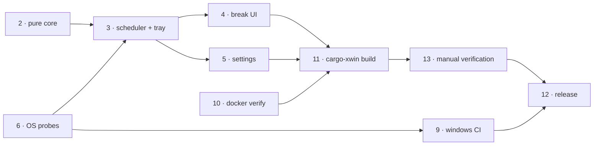

# Roadmap

Tagged **v0.1.0**. Everything automated passes and the app has been installed and
run. What remains is hands-on verification, led by escapability.

## Phases

| # | Phase | Status | Commit | Final evidence |
|---|---|---|---|---|
| 0 | Toolchain prerequisites | **abandoned by constraint** | - | MSVC Build Tools cannot be installed without admin: `0x80070005 … _bootstrapper is denied`, installer exit 5002. Superseded by phases 9 and 10. |
| 1 | Scaffold (Vite 2-entry, `src-vue/`, Cargo, tsconfig) | complete | `dbc5c1b` | `vite build` emits `index.html` + `break.html` as separate bundles. |
| 2 | Pure scheduling core + tests | **verified** | `32f3faa` | `cargo test`: **43 passed, 0 failed** in 0.01 s, on both Linux and windows-msvc. Covers both suppression rules, sleep/wake, pause/resume, clamping. |
| 3 | Scheduler, tray, window manager, IPC, capabilities | **verified at runtime** | `2693aeb` | Clippy clean, and the first run confirmed the tray icon appears with a live-updating tooltip, and that `invoke` works under minimal capabilities. |
| 4 | Break UI - AnimatedEye, CountdownRing, RuleGuide, Overlay + Toast | **overlay verified, toast not** | `9f74517` | Overlay renders correctly: dark veil, sweeping ring, animated eye, Skip and Snooze visible. Transparent always-on-top did not come out black on Windows 11. Toast style never displayed. |
| 5 | Settings window + persistence + autostart | **renders and is live** | `9f74517` | Settings window renders and shows a live countdown, so IPC and event delivery both work. Persistence round-trip and autostart still unexercised. |
| 6 | Windows idle + fullscreen probes | **compiles, runtime unverified** | `2c6d604` | Built on windows-msvc. The hand-written Win32 FFI was right first time: `GetWindowRect` returns `Result<()>`, `HWND == HWND::default()` is valid, `GetMonitorInfoW` returns `BOOL`. Whether they actually suppress a break is untested. |
| 7 | Icon generation | **complete** | `7c08bab` | `npm run icon` produced the desktop set; the eye reads correctly at 128px and in the tray. |
| 8 | Frontend verification | **complete** | - | `vue-tsc --noEmit` and `vite build` clean (break bundle 3.08 kB, carries no settings code). |
| 9 | Windows CI | **fully green** | `3dd940b` | All 3 jobs SUCCESS, including the release profile and both installers. |
| 10 | Docker verification path | **complete** | `2a77781` | `npm run verify`: frontend gates, fmt, clippy and 43 tests on a Linux toolchain, in seconds. Removed the dependency on CI logs that return 403 without a token. |
| 11 | Local Windows builds via cargo-xwin | **complete** | `86447a8` | `npm run build:windows` produces a real PE32 NSIS installer from Linux. 386 s cold release, 249 s cold dev, **35 s incremental**. |
| 12 | Release automation | **in progress** | `507ccc8`, `519c761` | `release.yml` fires on a `v*` tag: re-runs all gates on Windows, checks the tag matches `tauri.conf.json`, builds MSI + NSIS, publishes. First run is for `v0.1.0`. |
| 13 | Manual runtime verification | **partly done** | - | First install confirmed working; see *Remaining work*. |

## Dependencies

Docker (10, 11) covers the development loop. Windows CI (9, 12) covers the two
things a Linux container structurally cannot: `platform/win.rs` and the MSI.

## Fixes already worked through

Recorded so they are not rediscovered:

1. **`npm ci` failed** - `package-lock.json` was never regenerated after three
   `@tauri-apps/plugin-*` packages were dropped from `package.json`. *Whenever
   dependencies change, commit the lockfile.*
2. **`cargo fmt --all --check` failed** - the Rust was hand-written and rustfmt
   had never run. Verifiable locally, since fmt parses but never links.
3. **`cargo clippy -D warnings` failed** - one unused `Manager` import in
   `effects.rs`. `tray_by_id` is inherent on `AppHandle`, not a `Manager` method.
4. **Windows containers** - investigated and ruled out; see `hallucination`.
5. **`set -e` and `&&`** - `[ test ] && cmd` aborts a script when the test is
   false. Written twice, in `build-windows.sh` and `release.yml`. Use `if`.
6. **Vite 8 has no esbuild** - it builds on rolldown, so naming `'esbuild'` as the
   minifier fails to resolve.

## Remaining work

All of it needs a desktop; none can be automated.

1. **Escapability.** Do Escape, Skip and Snooze actually dismiss the overlay? The
   buttons render, but a press has never been observed. **Highest priority**: a
   frameless, transparent, always-on-top window that cannot be dismissed is the
   one failure that would make Irys feel like malware rather than a health app.
   Thirty seconds with *Break now* and the Escape key settles it.
2. **Background accuracy.** Set the interval to 1 minute, minimise every window,
   work elsewhere, confirm the break still fires on time. This is the entire
   justification for putting the clock in Rust rather than JavaScript.
3. **Toast style** - never displayed. Switch to Corner and trigger a break.
4. **Suppression at runtime** - idle-skip and fullscreen-defer. The logic is
   unit-tested and the probes compile, but they have never run against a live
   desktop.
5. **Autostart** - toggle on, confirm the `HKCU\...\Run` entry, re-login, confirm
   Irys is running, toggle off, confirm the entry is gone.
6. **Sleep/wake** - suspend across a break boundary; confirm no stale break fires
   on resume, which is what `SLEEP_GAP_SECS = 90` exists to prevent.
7. **Persistence** - change a setting, restart, confirm it survived.

Regression note: the Linux container does **not** compile `platform/win.rs`.
Treat any change to that file as CI-verified only.
