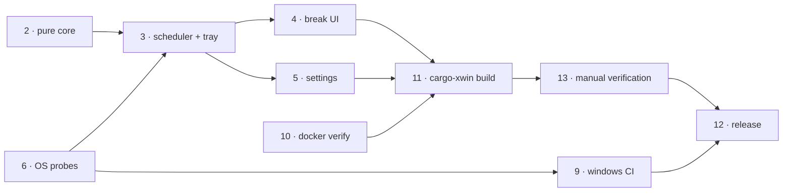

# Roadmap

**v0.1.2 is released** - `v0.1.0`, `v0.1.1` and `v0.1.2` have each published from a green Windows build with no manual release step. `v0.1.2` is the first tag whose GitHub release was checked directly (via the public API, not just source inspection) and carries all 4 real assets: NSIS `.exe`, `.msi`, `.deb`, `.AppImage`. It also bundles two changes the pack had not yet folded in: the Phase 15 WinUI 3 UI (`7bb879b`) and the `main.rs` fix that forces the Windows subsystem on every Windows build (`1e735a5`), so `v0.1.2` is the build the remaining manual checks below should target - not an older installer. The app has been installed and run on an earlier Windows build; hands-on verification of `v0.1.2` remains, led by escapability.

## Phases

| # | Phase | Status | Commit | Final evidence |
|---|---|---|---|---|
| 0 | Toolchain prerequisites | **abandoned by constraint** | - | MSVC Build Tools cannot be installed without admin: `0x80070005 … _bootstrapper is denied`, installer exit 5002. Superseded by phases 9 and 10. |
| 1 | Scaffold (Vite 2-entry, `src-vue/`, Cargo, tsconfig) | complete | `dbc5c1b` | `vite build` emits `index.html` + `break.html` as separate bundles. |
| 2 | Pure scheduling core + tests | **verified** | `32f3faa` | `cargo test`: **43 passed, 0 failed** in 0.01 s, on both Linux and windows-msvc. Covers both suppression rules, sleep/wake, pause/resume, clamping. |
| 3 | Scheduler, tray, window manager, IPC, capabilities | **verified at runtime** | `2693aeb` | Clippy clean, and the first run confirmed the tray icon appears with a live-updating tooltip, and that `invoke` works under minimal capabilities. |
| 4 | Break UI - AnimatedEye, CountdownRing, RuleGuide, Overlay + Toast | **runtime verified** | `9f74517` | Overlay renders correctly; user later confirmed Skip/Snooze dismissal and the Corner reminder. Escape remains unobserved. |
| 5 | Settings window + persistence + autostart | **runtime verified** | `9f74517` | Settings live countdown, persisted settings and autostart were confirmed by the user. Registry add/remove and re-login were not separately inspected. |
| 6 | Windows idle + fullscreen probes | **compiles, runtime unverified** | `2c6d604` | Built on windows-msvc. The hand-written Win32 FFI was right first time: `GetWindowRect` returns `Result<()>`, `HWND == HWND::default()` is valid, `GetMonitorInfoW` returns `BOOL`. Whether they actually suppress a break is untested. |
| 7 | Icon generation | **complete** | `7c08bab` | `npm run icon` produced the desktop set; the eye reads correctly at 128px and in the tray. |
| 8 | Frontend verification | **complete** | - | `vue-tsc --noEmit` and `vite build` clean (break bundle 3.08 kB, carries no settings code). |
| 9 | Windows CI | **fully green** | `3dd940b` | All 3 jobs SUCCESS, including the release profile and both installers. |
| 10 | Docker verification path | **complete** | `2a77781` | `npm run verify`: frontend gates, fmt, clippy and 43 tests on a Linux toolchain, in seconds. Removed the dependency on CI logs that return 403 without a token. |
| 11 | Local Windows builds via cargo-xwin | **complete** | `86447a8` | `npm run build:windows` produces a real PE32 NSIS installer from Linux. 386 s cold release, 249 s cold dev, **35 s incremental**. |
| 12 | Release automation | **complete** | `507ccc8`, `519c761`, `ce33e30`, `ccf4340` | `release.yml` fired on `v0.1.0` and succeeded end to end: all gates on Windows, tag matched `tauri.conf.json`, both installers published non-draft. Repeated automatically for `v0.1.1` and `v0.1.2` with no manual step; `v0.1.2` confirmed via the GitHub API as `draft:false`, `prerelease:false`, with 4 uploaded assets. |
| 13 | Manual runtime verification | **substantially verified** | - | User confirmed Skip/Snooze dismiss the overlay, minimized/background timing continues, Corner reminder displays, autostart works, and settings persist across restart. Idle/fullscreen suppression and sleep/wake remain unverified. |
| 14 | Linux packages in CI/release | **artifacts published, desktop runtime unverified** | `2f91859`, `ccf4340` | `ci.yml` adds `bundle-linux` on `ubuntu-22.04`; `release.yml` adds `build-linux` and uploads `.deb` + AppImage assets. `v0.1.2`'s GitHub release now carries both as real uploaded assets (`IRYS_0.1.2_amd64.deb`, `IRYS_0.1.2_amd64.AppImage`), which narrows the gap from "does the pipeline exist" to "does the resulting install/tray/break behave" - still not inspected on a Linux desktop. |
| 15 | WinUI 3 desktop UI refresh | **implemented; verification pending** | - | `src-vue` now has a desktop-shaped Fluent settings window with local light/dark appearance, a dark-only wide break overlay with the complete animated eye, and `IRYS` display branding across the user-facing app surfaces. Rust scheduling and IPC remain unchanged. |

## Dependencies

Docker (10, 11) covers the development loop. Windows CI (9, 12) covers the two things a Linux container structurally cannot: `platform/win.rs` and the MSI.

## Fixes already worked through

Recorded so they are not rediscovered:

1. **`npm ci` failed** - `package-lock.json` was never regenerated after three `@tauri-apps/plugin-*` packages were dropped from `package.json`. *Whenever dependencies change, commit the lockfile.*
2. **`cargo fmt --all --check` failed** - the Rust was hand-written and rustfmt had never run. Verifiable locally, since fmt parses but never links.
3. **`cargo clippy -D warnings` failed** - one unused `Manager` import in `effects.rs`. `tray_by_id` is inherent on `AppHandle`, not a `Manager` method.
4. **Windows containers** - investigated and ruled out; see `hallucination`.
5. **`set -e` and `&&`** - `[ test ] && cmd` aborts a script when the test is false. Written twice, in `build-windows.sh` and `release.yml`. Use `if`.
6. **Vite 8 has no esbuild** - it builds on rolldown, so naming `'esbuild'` as the minifier fails to resolve.

## Remaining work

All of it needs a desktop; none can be automated - confirmed again on this checkpoint: no phase in this roadmap is ready to execute without a person physically at the machine (pressing Escape, waiting out idle, opening a fullscreen app, suspending/resuming, watching the overlay). The existing Windows manual evidence does not establish equivalent Linux runtime behaviour, and it predates `v0.1.2`.

1. **Phase 15 desktop runtime check, on `v0.1.2`.** Install `IRYS_0.1.2_x64-setup.exe` (per-user, no admin) and confirm the implemented Settings navigation, stored light/dark appearance, full-screen break, Corner reminder and Escape handling. Skip and Snooze were confirmed before this UI refresh and need a regression check.
2. **Suppression at runtime** - idle-skip and fullscreen-defer. The logic is unit-tested and the probes compile, but they have never run against a live desktop.
3. **Sleep/wake** - suspend across a break boundary; confirm no stale break fires on resume, which is what `SLEEP_GAP_SECS = 90` exists to prevent.
4. **Windows GUI startup on `v0.1.2`.** Start the app from its normal shortcut/command and confirm no terminal panel appears - this build carries the `main.rs` Windows-subsystem fix (`1e735a5`) that the previous checkpoint had not yet had a rebuilt app to test.

Regression note: the Linux container does **not** compile `platform/win.rs`. Treat any change to that file as CI-verified only.

UI implementation note: phase 15 is a visual/layout change, not permission or scheduler work. Preserve the existing Rust-owned state, IPC contract, two-window model, accessibility, reduced-motion support, and escapability while replacing the presentation.
