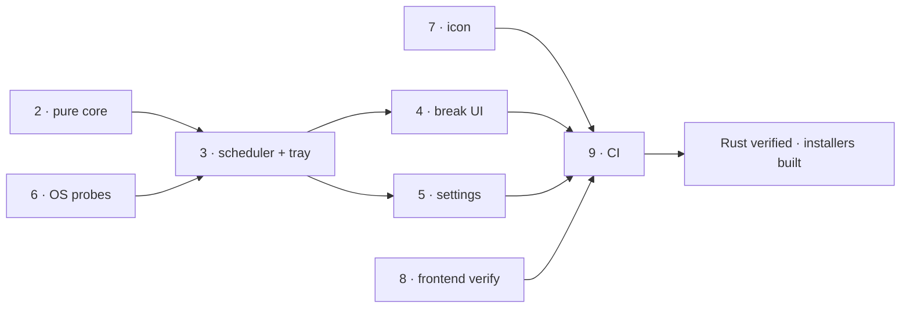

# Roadmap

## Phases

| # | Phase | Status | Commit | Final evidence |
|---|---|---|---|---|
| 0 | Toolchain prerequisites | **abandoned by constraint** | — | Rust installed OK. MSVC Build Tools cannot be installed without admin; failed with `0x80070005 … _bootstrapper is denied`, installer exit 5002. Verified no MSVC or Windows SDK anywhere on the machine. Superseded by phase 9 (CI). |
| 1 | Scaffold (Vite 2-entry, `src-vue/`, Cargo, tsconfig) | complete | `dbc5c1b` | `vite build` emits `index.html` + `break.html` as separate bundles. |
| 2 | Pure scheduling core + tests | code complete, **unverified** | `32f3faa` | 43 `#[test]` cases written covering both suppression rules, sleep/wake, pause/resume, clamping. **Never executed.** |
| 3 | Scheduler, tray, window manager, IPC, capabilities | code complete, **unverified** | `2693aeb` | Never compiled. |
| 4 | Break UI — AnimatedEye, CountdownRing, RuleGuide, Overlay + Toast | code complete, **appearance unverified** | `9f74517` | `vue-tsc` clean; `vite build` clean. Never rendered. |
| 5 | Settings window + persistence + autostart | code complete, **unverified** | `9f74517` | `vue-tsc` clean. Round-trip never exercised. |
| 6 | Windows idle + fullscreen probes | code complete, **unverified** | `2c6d604` | Never compiled. All `unsafe` confined to `platform/win.rs`. |
| 7 | Icon generation | **complete** | `7c08bab` | `npm run icon` produced the full desktop set; 128px output inspected and reads as an eye. |
| 8 | Frontend verification | **complete** | — | `vue-tsc --noEmit` clean; `vite build` clean (break bundle 3.08 kB, carries no settings code). |
| 9 | CI as the build gate | workflow written, **never run** | `3dd940b` | `.github/workflows/ci.yml`: 3 jobs — frontend, Rust fmt/clippy/test, installers. |

## Dependencies

Phase 9 is the gate everything unverified now depends on.

## Next action

**Push the 8 unpushed commits to `origin/main` and read the first CI run.**

`origin/main` is at `9e47e41`; `HEAD` is `3dd940b`. Nothing has been pushed.
Pushing requires the user's go-ahead — it has not been given, so the work stops
exactly here.

The first run is expected to fail. Work the failures in this order, because they
are ordered by likelihood and the earlier ones block the later ones:

1. **CI itself** — action versions and YAML; the workflow has never executed.
2. **`platform/win.rs` signatures** — whether `GetWindowRect` returns
   `Result<()>` or `BOOL`, and whether `HWND` compares against `HWND::default()`,
   both move between `windows` crate releases. Local fixes.
3. **`windows_mgr.rs` monitor APIs** — `cursor_position()` and
   `monitor_from_point()` are used to put the overlay on the monitor holding the
   cursor. If either is not on `WebviewWindow` in Tauri 2.11, fall back to
   `primary_monitor()` alone and accept that multi-monitor users may get the
   overlay on the wrong screen.
4. **`cargo clippy -- -D warnings`** — never run; expect pedantic lints.
5. **Capability minimality** — see `hallucination`, open question 1.

After green: download the NSIS artifact (per-user install, needs no admin) and run
the manual checks in `useguide`.
