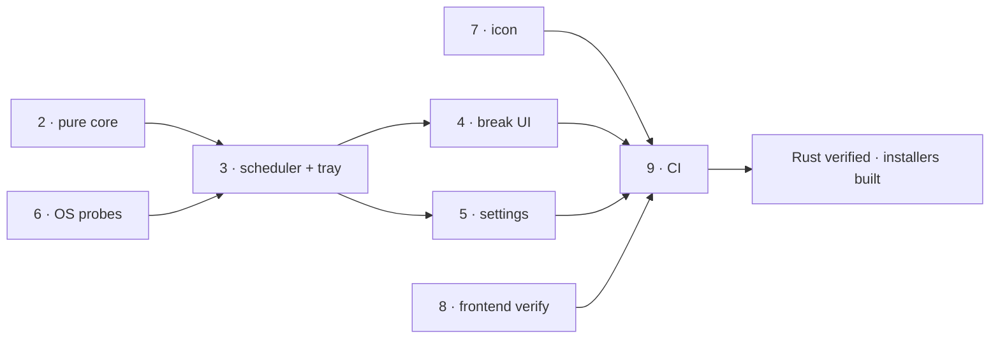

# Roadmap

## Phases

| # | Phase | Status | Commit | Final evidence |
|---|---|---|---|---|
| 0 | Toolchain prerequisites | **abandoned by constraint** | - | Rust installed OK. MSVC Build Tools cannot be installed without admin; failed with `0x80070005 … _bootstrapper is denied`, installer exit 5002. Verified no MSVC or Windows SDK anywhere on the machine. Superseded by phase 9 (CI). |
| 1 | Scaffold (Vite 2-entry, `src-vue/`, Cargo, tsconfig) | complete | `dbc5c1b` | `vite build` emits `index.html` + `break.html` as separate bundles. |
| 2 | Pure scheduling core + tests | **complete and verified** | `32f3faa` | `cargo test`: **43 passed, 0 failed** in 0.01 s. Covers both suppression rules, sleep/wake, pause/resume, clamping. |
| 3 | Scheduler, tray, window manager, IPC, capabilities | **compiles clean** | `2693aeb` | `cargo clippy -D warnings` clean. Runtime behaviour still needs a desktop. |
| 4 | Break UI - AnimatedEye, CountdownRing, RuleGuide, Overlay + Toast | code complete, **appearance unverified** | `9f74517` | `vue-tsc` clean; `vite build` clean. Never rendered. |
| 5 | Settings window + persistence + autostart | code complete, **unverified** | `9f74517` | `vue-tsc` clean. Round-trip never exercised. |
| 6 | Windows idle + fullscreen probes | **compiles verified** | `2c6d604` | Built on windows-msvc in CI. The hand-written Win32 FFI was correct first time: `GetWindowRect` does return `Result<()>`, `HWND == HWND::default()` is valid, `GetMonitorInfoW` returns `BOOL`. Runtime behaviour still needs a desktop. |
| 7 | Icon generation | **complete** | `7c08bab` | `npm run icon` produced the full desktop set; 128px output inspected and reads as an eye. |
| 8 | Frontend verification | **complete** | - | `vue-tsc --noEmit` clean; `vite build` clean (break bundle 3.08 kB, carries no settings code). |
| 9 | Windows CI as the build gate | **fully green** | `3dd940b` | Run for `bf6c7b9`: all 3 jobs SUCCESS. Includes the release profile (`lto`, `panic = "abort"`) and `irys-windows-installers` at 2.83 MB. |
| 10 | Docker verification path | **complete and proven** | `2a77781` | `docker compose -f docker/compose.yml run --rm -T verify`: fmt, clippy and 43 tests all pass on a Linux toolchain, in seconds. Removed the dependency on unreadable CI logs. |

## Dependencies

Phase 10 (Docker) verified phases 2-5 and 8. Phase 9 (Windows CI) remains the only
gate for phase 6 and the installers.

## Fixes already worked through

Recorded so they are not rediscovered:

1. **`npm ci` failed** - `package-lock.json` was never regenerated after three
   `@tauri-apps/plugin-*` packages were dropped from `package.json`. Fixed by
   `npm install`; reproduced locally first. *Whenever dependencies change, commit
   the lockfile.*
2. **`cargo fmt --all --check` failed** - the Rust was hand-written and rustfmt had
   never run. Fixed, and verifiable locally since fmt never links.
3. **`cargo clippy -D warnings` failed** - one unused `Manager` import in
   `effects.rs`. `tray_by_id` is inherent on `AppHandle`, not a `Manager` method.
4. **Windows containers** - investigated and ruled out; see `hallucination`.

## Next action

**Every automated gate passes. The remaining work is hands-on, and cannot be
automated away - it needs a real desktop.**

Download `irys-windows-installers` from the CI run and use the **NSIS** installer
(per-user, no admin). Then work the manual checks in `useguide`, in this order:

1. **Escapability first.** Escape, Skip and Snooze on the fullscreen overlay. A
   frameless, transparent, always-on-top window that cannot be dismissed is
   indistinguishable from UI-spoofing malware, so this is the one check that
   gates everything else.
2. **Background accuracy.** Set `workSecs` to 60, minimise every window, work
   elsewhere for a full interval, confirm the break still fires on time. This is
   the entire justification for putting the timer in Rust.
3. Both break styles render; tray tooltip counts down; idle-skip and
   fullscreen-defer actually suppress; autostart writes and removes its `Run`
   entry; sleep/wake produces no stale break.

Open question 1 in `hallucination` resolves on first launch: if `invoke` is
rejected, the per-window capabilities are too tight and need `core:default`.

Regression note: the Linux container does **not** compile `platform/win.rs`.
Treat any change to that file as CI-verified only.
