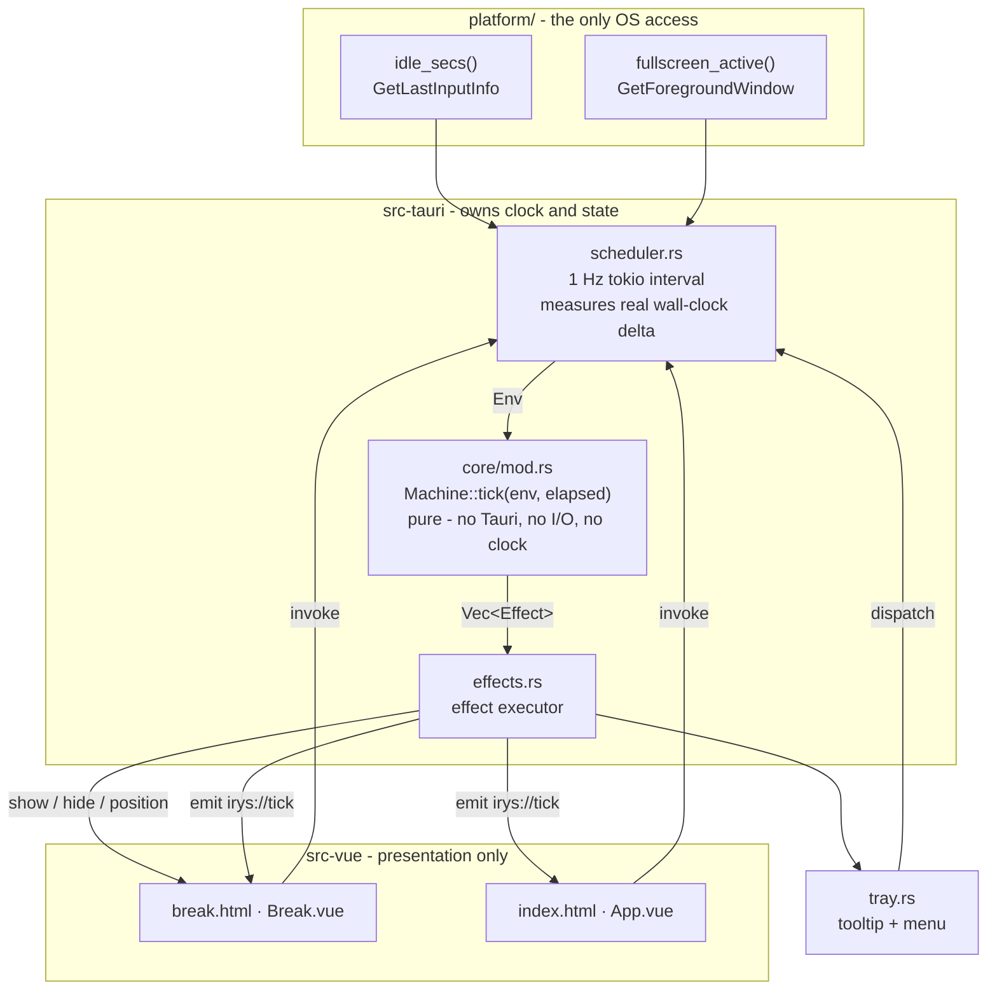
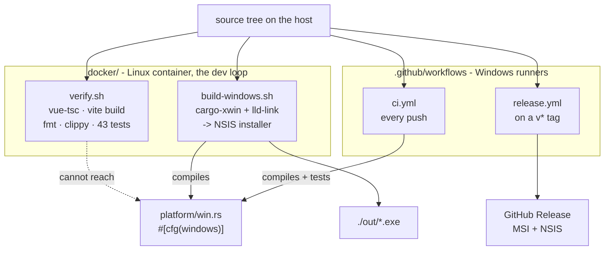

# Architecture and execution flow

## The one idea that shapes everything

**Rust owns the clock and all state; Vue renders.** Webviews throttle timers when
hidden or minimised, and Irys normally has no window on screen at all - so the
schedule cannot live in JavaScript. Everything below follows from that.

## Layers



## The pure core - `src-tauri/src/core/mod.rs`

Holds **no Tauri types, no I/O, no clock, no logging**. Time arrives as an
`elapsed_secs` argument; OS state arrives as an injected `Env { idle_secs,
fullscreen_active }`. Output is `Vec<Effect>` - data describing what should
happen, never the doing of it.

That purity is the whole reason 43 tests can cover the complete schedule -
including sleep/wake and both suppression rules - instantly and with no window.

**The rule to preserve when editing: never reach for the clock or the OS in here.
Add a field to `Env` instead.**

```rust
enum Phase { Work { remaining }, Break { remaining }, Paused { resume_to: Box<Phase> } }
enum Effect { ShowBreak(BreakStyle), HideBreak, Prewarn, Tray(String) }

fn tick(&mut self, env: Env, elapsed_secs: u32) -> Vec<Effect>
```

Two non-obvious behaviours, both deliberate:

- **`elapsed_secs` is measured, not assumed to be 1.** A loaded machine that
  misses ticks still keeps an accurate schedule. A gap `>= SLEEP_GAP_SECS` (90) is
  read as sleep/hibernate and *restarts* the interval rather than firing a break
  that is already stale the instant the lid opens.
- **Suppression is asymmetric.** Idle beyond the threshold **resets** the interval
  (the eyes already rested). A fullscreen foreground app **defers** by the snooze
  interval and re-checks (the break is still owed). Idle takes precedence over
  fullscreen, so a fullscreen video playing to an empty chair resets rather than
  deferring forever.

`Settings::sanitized()` clamps every duration in the core, so no other layer has
to trust values from the UI or a hand-edited store file.

## The single mutation path - `scheduler.rs`

```rust
pub fn dispatch(app: &AppHandle, action: impl FnOnce(&mut Machine) -> Vec<Effect>)
```

Commands, tray menu items, the break window, and the 1 Hz tick **all** funnel
through `dispatch`. One place mutates state; one place runs effects; one place
broadcasts the snapshot.

The machine lock is released *before* effects run - showing a window re-enters
Tauri, and holding the lock across that invites deadlock. The lock also recovers
from poisoning (`unwrap_or_else(|e| e.into_inner())`) rather than propagating a
panic, because a panic that killed the scheduler would present to the user as
"breaks silently stopped forever".

`SystemTime` is used rather than `Instant` **specifically** because a monotonic
clock can stop across system sleep, and detecting that gap is the point.

## Windows - `windows_mgr.rs`

Both windows are declared in `tauri.conf.json` and created **hidden at startup**,
not on demand: creating a webview takes long enough to flash white, which is a bad
look for something that appears over your work.

| Window | Config | Lifecycle |
|---|---|---|
| `settings` (`index.html`) | decorated, `visible: false` | Tray opens it. `CloseRequested` → `prevent_close()` + `hide()`. |
| `break` (`break.html`) | frameless, `alwaysOnTop`, `skipTaskbar`, `transparent`, `shadow: false`, `visible: false` | Resized/positioned per break, then shown. Closing it is treated as a Skip. |

`RunEvent::ExitRequested` is prevented **only when `code: None`**, so the default
"last window closed means exit" cannot kill a tray app, while an explicit
`app.exit(0)` from Quit still works.

## OS boundary - `platform/`

Two functions, `#[cfg]`-split, are the entire OS surface. **All `unsafe` in the
project lives in `platform/win.rs`**; `stub.rs` reports never-idle/never-fullscreen
so macOS and Linux compile and behave as if both suppression rules were off.

`idle_secs()` compares `GetLastInputInfo`'s 32-bit tick count against the low 32
bits of `GetTickCount64` with a wrapping subtraction - otherwise the ~49-day wrap
surfaces as a multi-week idle time.

`fullscreen_active()` compares the foreground window against the **full monitor
rect**, not the work area, so an ordinary maximised window (which stops at the
taskbar) is correctly *not* treated as fullscreen.

## Frontend - `src-vue/`

`composables/useTimer.ts` runs **no timer**. It seeds from `get_snapshot` and then
only reflects what Rust pushes on `irys://tick`.

`Break.vue` serves both styles from one tree - Rust has already sized and
positioned the window, and tells Vue which style via `snapshot.style`.

`AnimatedEye.vue` is inline SVG plus CSS keyframes: no image, sprite, or icon
dependency, so it scales from 56 px to a 4K overlay and needs nothing loosened in
the CSP. The blink is a `scaleY` squash rather than a moving lid shape,
specifically so it works on the translucent overlay veil where a
background-matched lid would not.

## Build and verification topology

Not incidental scaffolding: the development machine cannot install MSVC, so how
this project gets compiled is part of its architecture.



Two things worth internalising:

- **`verify` runs every gate even when one fails.** Deliberately the opposite of
  CI's fail-fast. A formatting error once hid a clippy error, which hid whether
  the tests passed; three round-trips to learn one thing.
- **`cargo-xwin` compiles `platform/win.rs`, `verify` does not.** The Linux
  *target* cfg-gates that file out, but the cross-compile targets
  `x86_64-pc-windows-msvc`, so `#[cfg(windows)]` is active. `verify` alone will
  not catch a regression there.

Caches live in Docker volumes rather than the bind mount: `CARGO_TARGET_DIR`,
the cargo registry, the xwin SDK cache, `node_modules` and `dist`. The host's
`node_modules` in particular must not be shared - it holds Windows-native
`esbuild`/`rolldown` binaries that cannot execute in a Linux container.

## Security posture

- **Least privilege:** all plugin work (store, autostart, notification) is in
  Rust, and Irys's own commands need no grant, so each window is given only
  `core:event` listen/unlisten. No `shell`, `fs`, `http`, or `dialog` plugin is
  added at all. The always-on-top break window has no path to store, filesystem,
  shell, or network.
- **CSP** is `default-src 'self'` with `object-src 'none'`, `base-uri 'none'`,
  `form-action 'none'`. Everything is inline SVG/CSS and a synthesised chime, so
  nothing needs relaxing.
- **The overlay must stay escapable.** Escape closes it and Skip/Snooze are always
  visible. It requests window focus but never captures raw input or blocks the OS.
  A frameless, transparent, always-on-top window that could not be dismissed is
  the same primitive UI-spoofing malware uses. **Never add a
  "cannot be dismissed" mode.**
- **Autostart** writes a per-user `HKCU\...\Run` entry - no elevation, visible in
  Task Manager's Startup tab, removed when toggled off.
- **Persistence** is one JSON file of preferences. No credentials, no telemetry.
